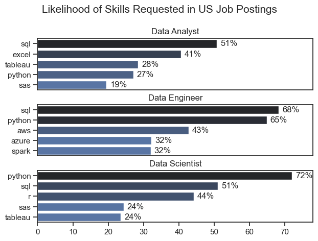
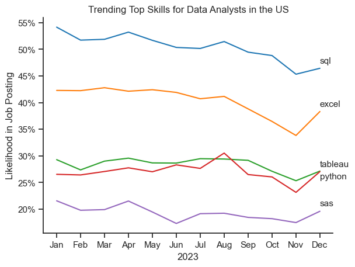
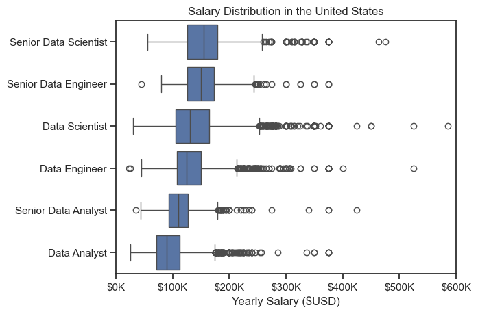
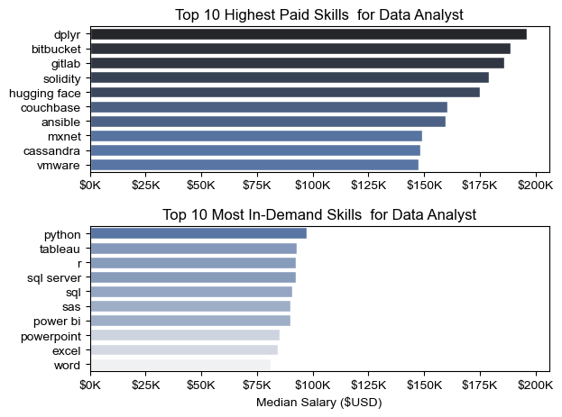
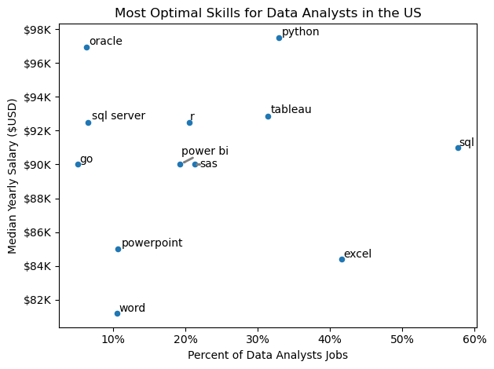
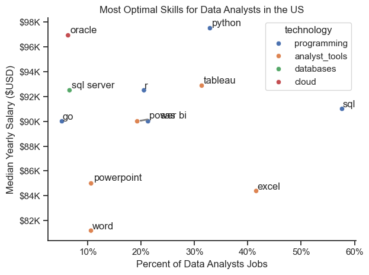

# Overview
Welcome to my exploration of the data job market, specifically targeting data analyst roles. This project was born from a desire to more effectively understand and navigate job opportunities in the field. It examines the highest-paying and most sought-after skills to aid in discovering ideal roles for data analysts.

The data used in this analysis comes from Luke Barousse's Python course, providing a robust basis with comprehensive details on job titles, salary patterns, and the link between demand and compensation in data analytics.

# The Questions
Below are the key questions this project aims to answer:

1. Which skills are most in demand for the top three most popular data roles?
2. What are the current trends in demand for skills among Data Analysts?
3. How do various jobs and skills for Data Analysts align with pay levels?
4. What are the optimal skills for Data Analysts to learn, based on high demand and high pay?

# Tools I Used
For my in-depth analysis of the data analyst job market, I leveraged several essential tools:

* Python: The core of my analysis, enabling data processing and insights discovery.
    * Pandas: The primary library I used to manipulate and analyze data.
    * Matplotlib: Used to create foundational data visualizations.
    * Seaborn: Used for more sophisticated and advanced visualizations.
* Jupyter Notebooks: This platform allowed me to run Python scripts and seamlessly integrate notes and analysis.
* Visual Studio Code: My preferred editor for running Python scripts.
* Git & GitHub: Crucial for version control and sharing, allowing for collaboration and efficient project tracking.

# Data Preparation and Cleanup
This section details the steps taken to prepare the data for analysis, focusing on ensuring both accuracy and usability.

## Import & Clean Up Data
I began by importing the required libraries and loading the dataset, then performed initial data cleaning tasks to maintain data quality.

```python
# Importing Libraries
import ast
import pandas as pd
import seaborn as sns
from datasets import load_dataset
import matplotlib.pyplot as plt

# Loading Data
dataset = load_dataset('lukebarousse/data_jobs')
df = dataset['train'].to_pandas()

# Data Cleanup
df['job_posted_date'] = pd.to_datetime(df['job_posted_date'])
df['job_skills'] = df['job_skills'].apply(lambda x: ast.literal_eval(x) if pd.notna(x) else x)
```
## Filter US Jobs
To center my analysis on the U.S. job market, I filter the dataset to include only roles located in the United States.

```python
df_US =  df[df['job_country'] == 'United States']
```

# The Analysis
Each Jupyter notebook in this project is dedicated to exploring specific aspects of the data job market. Here’s how I approached each question:

## 1. Which skills are most in demand for the top three most popular data roles?
To identify the most in-demand skills for the top three data roles, I first filtered the dataset to focus on the most popular positions. Then, I extracted the top 5 skills for these roles. This analysis highlights the key job titles and their most sought-after skills, helping me determine which skills to prioritize based on the roles I'm targeting.

View my notebook with detailed steps here: [2_Skills_Count](3_Project/2_Skills_Count.ipynb)

### Visualize Data
```python
fig, ax = plt.subplots(len(job_titles), 1)

for i, job_title in enumerate(job_titles):
    df_plot = df_skills_perc[df_skills_perc['job_title_short'] == job_title].head(5)
    sns.barplot(data=df_plot, x='skill_percent', y='job_skills', ax=ax[i], hue='skill_count', palette='dark:b_r')

plt.show()
```
### Results


### Insights:
* SQL is Essential Across All Roles: SQL is the most common skill across all three positions, with 51% of Data Analysts, 68% of Data Engineers, and 51% of Data Scientists listing it as a top skill. This indicates that SQL is a fundamental tool for professionals in all major data roles.
* Python Dominates in Data Science and Data Engineering: Python stands out as the most in-demand skill for both Data Engineers (65%) and Data Scientists (72%). It shows that Python is crucial for handling data manipulation, analysis, and machine learning tasks, making it a must-have skill for these roles.
* Role-Specific Tools and Technologies: Each role has distinct skills reflecting its focus area:
   * Data Analysts lean heavily on tools like Excel (41%) and Tableau (28%), which are vital for data visualization and reporting.
   * Data Engineers focus more on cloud platforms and big data tools like AWS (43%) and Spark (32%), indicating their role in building scalable data infrastructure.
   * Data Scientists prioritize R (44%) for statistical analysis and machine learning, as well as SAS (24%) for more advanced analytics.

## 2. What are the current trends in demand for skills among Data Analysts?
To analyze the trending skills for Data Analysts in 2023, I filtered job postings for data analyst roles and organized the skills by month. This allowed me to identify the top 5 skills for Data Analysts each month, revealing how the popularity of these skills evolved throughout the year.

View my notebook with detailed steps here: [3_Skills_Trend](3_Project/3_Skills_Trend.ipynb)

### Visualize Data
```python
from matplotlib.ticker import PercentFormatter

sns.lineplot(data=df_plot, dashes=False, legend='full', palette='tab10')

ax = plt.gca()
ax.yaxis.set_major_formatter(PercentFormatter(decimals=0))

plt.show()
```

### Results


*A bar graph showing the monthly trend of the top skills for Data Analysts in the U.S. throughout 2023.*

### Insights:
* SQL continues to be the most consistently sought-after skill throughout the year, despite experiencing a gradual decline in demand.
* November marks a significant shift for all skills, as they all show a noticeable increase in demand following a steady decline earlier in the year.
* Throughout the year, SAS consistently had the lowest demand, starting at 23% and following a similar downward trend before rising in November, though still lagging behind the other skills. 

## 3. How do various jobs and skills for Data Analysts align with pay levels?
To determine the highest-paying roles and skills, I focused on job postings in the United States and analyzed their median salaries. Initially, I examined the salary distributions for common data roles such as Data Scientist, Data Engineer, and Data Analyst to understand which positions offer the highest pay.

View my notebook with detailed steps here: [4_Salary_Analysis](3_Project/4_Salary_Analysis.ipynb)

### Visualize Data
```python
sns.boxplot(data=df_US_top6, x='salary_year_avg', y='job_title_short', order=job_order)

ticks_x = plt.FuncFormatter(lambda y, pos: f'${int(y/1000)}K')
plt.gca().xaxis.set_major_formatter(ticks_x)
plt.show()
```

### Results


*A box plot showing salary distributions for the top 6 data job titles.*

### Insights:
* Salary ranges vary significantly across job titles, with Senior Data Scientist roles offering the highest salary potential, reaching up to $600K, reflecting the premium placed on advanced data skills and experience.
* Senior Data Engineer and Senior Data Scientist roles exhibit a notable number of high-end salary outliers, indicating that exceptional skills or unique circumstances can result in significantly higher pay. In contrast, Data Analyst roles show more salary consistency, with fewer outliers.
* Median salaries rise with the seniority and specialization of roles, with Senior Data Scientist and Senior Data Engineer positions not only offering higher median salaries but also showing greater variation in compensation, reflecting the increased responsibilities and expertise required.

## Highest Paid & Most Demanded Skills for Data Analysts
Next, I refined my analysis to focus solely on Data Analyst roles, examining both the highest-paid skills and the most in-demand skills, which I visualized using two bar charts.

### Visualize Data
```python
fig, ax = plt.subplots(2, 1)  

# Top 10 Highest Paid Skills for Data Analysts
sns.barplot(data=df_DA_top_pay, x='median', y=df_DA_top_pay.index, hue='median', ax=ax[0], palette='dark:b_r')

# Top 10 Most In-Demand Skills for Data Analystsr')
sns.barplot(data=df_DA_skills, x='median', y=df_DA_skills.index, hue='median', ax=ax[1], palette='light:b')

plt.show()
```

### Results


*Two separate bar graphs visualizing the highest-paid skills and the most in-demand skills for Data Analysts in the U.S.*

### Insights:
* The top graph reveals that specialized technical skills like dplyr, Bitbucket, and Gitlab are linked to higher salaries, with some reaching up to $200K, indicating that advanced technical expertise can boost earning potential.
* The bottom graph highlights that core skills like Excel, PowerPoint, and SQL are the most in-demand, even though they may not command the highest salaries, underscoring their essential role in securing data analysis positions.
* A clear distinction exists between the highest-paid skills and the most in-demand ones. Data analysts looking to maximize their career potential should focus on building a diverse skill set that combines both high-paying specialized skills and essential, widely demanded foundational skills.

## 4. What are the optimal skills for Data Analysts to learn, based on high demand and high pay?
To determine the most valuable skills to acquire (those that are both highly paid and in high demand), I calculated the demand percentage and median salary for each skill, simplifying the process of identifying the best skills to focus on.

View my notebook with detailed steps here: [5_Optimal_Skills](3_Project/5_Optimal_Skills.ipynb)

### Visualize Data
```python
from adjustText import adjust_text
import matplotlib.pyplot as plt

plt.scatter(df_DA_skills_high_demand['skill_percent'], df_DA_skills_high_demand['median_salary'])
plt.show()
```

### Results


*A scatter plot showcasing the most optimal skills for Data Analysts in the U.S., highlighting those that are both high-paying and in high demand.*

### Insights:
* Python stands out with the highest median salary of nearly $97K, even though it appears less frequently in job postings, indicating that specialized database skills are highly valued within the data analyst profession.
* Skills like Excel and SQL, while frequently appearing in job listings, have lower median salaries compared to specialized skills such as Python and Tableau, which offer higher salaries and are also moderately common in job postings.
* Python, Tableau, and SQL Server are among the higher-paying skills and are frequently found in job listings, highlighting that proficiency in these tools can lead to valuable opportunities in data analytics.


## Visualizing Different Techonologies

To enhance the graph, we'll categorize the technologies by adding color labels based on the technology type (e.g., {Programming: Python}) to visually distinguish between different categories like programming languages, databases, and visualization tools.

### Visualize Data
```python
from matplotlib.ticker import PercentFormatter

# Create a scatter plot
scatter = sns.scatterplot(
    data=df_DA_skills_tech_high_demand,
    x='skill_percent',
    y='median_salary',
    hue='technology',  # Color by technology
    palette='bright',  # Use a bright palette for distinct colors
    legend='full'  # Ensure the legend is shown
)
plt.show()
```

### Results


*A scatter plot displaying the most optimal skills (both high-paying and in-demand) for Data Analysts in the U.S., with color labels representing.*


### Insights:
* The scatter plot indicates that programming skills (marked in blue) are mostly found at higher salary levels, implying that expertise in programming could offer better salary prospects within the data analytics field.
* Cloud skills, (marked in red) such as Oracle, are associated with some of the highest salaries, despite having relatively low demand, suggesting that specialized expertise in this area is highly valued even if it's less commonly sought.
* Analyst tools (marked in orange), like Tableau and Power BI, are commonly featured in job listings and offer attractive salaries, indicating that visualization and data analysis software are essential for modern data roles. This category provides strong earning potential and is adaptable to various data-related tasks.

# What I Learned

Throughout this project, I gained a deeper understanding of the data analyst job market and improved my technical skills in Python, particularly in data manipulation and visualization. Here are a few key takeaways:

* __Advanced Python Techniques:__  I leveraged libraries like Pandas for data manipulation, Seaborn and Matplotlib for visualization, and others to perform complex analyses more effectively.
* __The Importance of Data Cleaning:__ I realized that thorough data cleaning and preparation are essential before conducting any analysis to ensure the accuracy of the resulting insights.
* __Strategic Skill Analysis:__ This project highlighted the significance of aligning skills with market demand. Understanding how skill demand, salary, and job opportunities intersect enables more informed career planning in the tech industry.

# Insights

This project revealed several key insights into the data job market for analysts:

* __Skill Demand and Salary Relationship:__ A clear link exists between the demand for specific skills and the salaries they command. Advanced and specialized skills, such as Python and Oracle, typically result in higher earnings.
* __Market Trends:__ Skill demand trends are constantly evolving, emphasizing the dynamic nature of the data job market. Staying updated on these trends is crucial for advancing in the field of data analytics.
* __Economic Value of Skills:__ Recognizing which skills are both in-demand and well-compensated can help data analysts focus their learning efforts to maximize their earning potential.

# Conclusion

This exploration of the data analyst job market has been highly enlightening, shedding light on the key skills and trends that influence this ever-evolving field. The insights gained have deepened my understanding and offer practical advice for those aiming to advance their careers in data analytics. As the market keeps evolving, continuous analysis will be crucial for staying competitive in data analytics. This project lays a solid foundation for future investigations and emphasizes the need for ongoing learning and adaptability in the data industry.